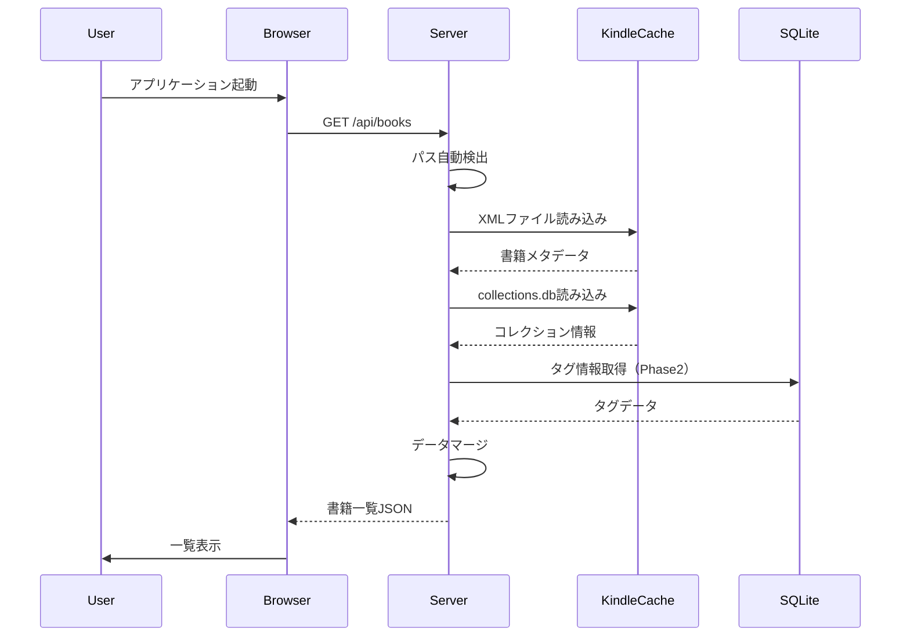
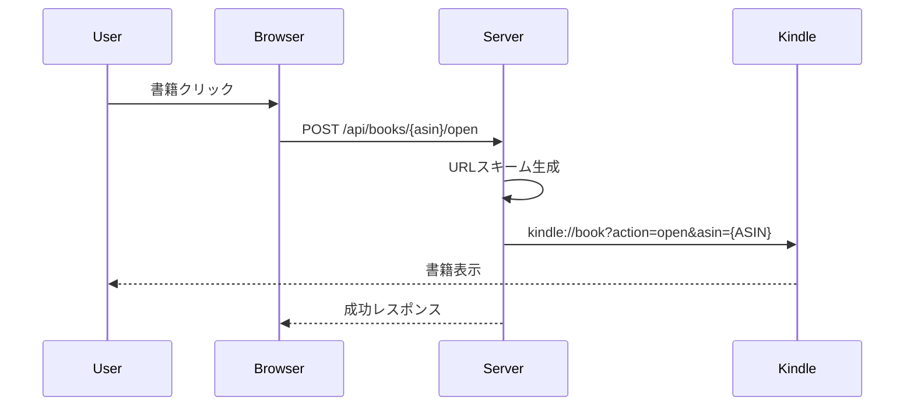

# Kindle蔵書管理システム アーキテクチャ設計書

## 1. システム全体構成

### 1.1 アーキテクチャ概要
```
┌─────────────────────────────────────────────────────────┐
│                    ユーザー環境（Windows PC）               │
│                                                         │
│  ┌─────────────────┐        ┌──────────────────┐      │
│  │   Webブラウザ     │        │  PC版Kindleアプリ  │      │
│  │   (Chrome等)     │        │                  │      │
│  │                 │        │                  │      │
│  │  ┌──────────┐  │        │ ┌──────────────┐ │      │
│  │  │  React   │  │◄───────►│ │URLスキーム   │ │      │
│  │  │  Client  │  │ kindle://│ │ハンドラー    │ │      │
│  │  └──────────┘  │        │ └──────────────┘ │      │
│  └────────┬────────┘        └──────────────────┘      │
│           │ HTTP                      ▲                │
│           │ (localhost:3001)          │                │
│           ▼                           │                │
│  ┌─────────────────────────────────────────────┐      │
│  │         Node.js Expressサーバー               │      │
│  │                                             │      │
│  │  ┌──────────┐  ┌─────────┐  ┌──────────┐ │      │
│  │  │  API     │  │ Parser  │  │  Kindle  │ │      │
│  │  │ Routes   │◄─┤ Service │◄─┤ Launcher │ │      │
│  │  └──────────┘  └─────────┘  └──────────┘ │      │
│  │         ▲           │                      │      │
│  │         │           ▼                      │      │
│  │  ┌──────────┐  ┌─────────────────────┐   │      │
│  │  │  SQLite  │  │  Kindleキャッシュ     │   │      │
│  │  │    DB    │  │  ・XML              │   │      │
│  │  │ (タグ等) │  │  ・synced_collections│   │      │
│  │  └──────────┘  └─────────────────────┘   │      │
│  └─────────────────────────────────────────────┘      │
└─────────────────────────────────────────────────────────┘
```

### 1.2 コンポーネント責務

| コンポーネント | 責務 |
|---------------|------|
| React Client | UI表示、ユーザー操作処理、APIとの通信 |
| Express Server | APIエンドポイント提供、ビジネスロジック実行 |
| Parser Service | Kindleファイルの解析、データ変換 |
| Kindle Launcher | URLスキーム経由でKindleアプリを起動 |
| SQLite DB | システム独自データ（タグ等）の永続化 |

---

## 2. ディレクトリ構造

```
kindle_bookmark/
├── docs/                       # ドキュメント
│   └── specifications/
│       ├── requirements_definition.md
│       ├── system_architecture.md
│       └── api_specification.md
│
├── src/                        # アプリケーションソースコード
│   ├── server/                 # バックエンド（Node.js + Express）
│   │   ├── src/
│   │   │   ├── app.ts             # Expressアプリケーション設定
│   │   │   ├── server.ts          # サーバー起動エントリーポイント
│   │   │   ├── config/
│   │   │   │   └── database.ts    # DB接続設定
│   │   │   ├── routes/
│   │   │   │   ├── books.ts       # 書籍関連API
│   │   │   │   ├── sync.ts        # 同期API
│   │   │   │   └── collections.ts # コレクション関連API
│   │   │   ├── services/
│   │   │   │   ├── kindleParser.ts    # XMLパーサー
│   │   │   │   ├── collectionParser.ts # SQLiteパーサー
│   │   │   │   ├── kindleLauncher.ts  # Kindle起動処理
│   │   │   │   └── pathDetector.ts    # パス自動検出
│   │   │   ├── models/
│   │   │   │   ├── book.ts        # 書籍モデル
│   │   │   │   └── tag.ts         # タグモデル（Phase2）
│   │   │   └── utils/
│   │   │       └── logger.ts      # ロギング
│   │   ├── data/
│   │   │   └── app.db             # SQLiteデータベース
│   │   ├── package.json
│   │   └── .env.example           # 環境変数サンプル
│   │
│   └── client/                     # フロントエンド（React）
│       ├── public/
│       │   └── index.html
│       ├── src/
│       │   ├── App.tsx            # メインアプリケーション
│       │   ├── index.tsx          # エントリーポイント
│       │   ├── components/
│       │   │   ├── BookGrid.tsx   # グリッド表示
│       │   │   ├── BookList.tsx   # リスト表示
│       │   │   ├── BookCard.tsx   # 書籍カード
│       │   │   ├── SearchBar.tsx  # 検索バー
│       │   │   ├── FilterPanel.tsx # フィルターパネル
│       │   │   └── ViewToggle.tsx # 表示切替
│       │   ├── services/
│       │   │   └── api.ts         # APIクライアント
│       │   ├── hooks/
│       │   │   ├── useBooks.ts    # 書籍データフック
│       │   │   └── useFilter.ts   # フィルターフック
│       │   ├── types/
│       │   │   └── index.ts       # TypeScript型定義
│       │   └── styles/
│       │       └── App.css
│       ├── package.json
│       ├── tsconfig.json          # TypeScript設定
│       └── .env.example
│
├── scripts/                    # ユーティリティスクリプト
│   └── setup.ts               # 初期セットアップ
│
├── .gitignore
├── README.md
├── tsconfig.json              # ルートTypeScript設定
└── package.json               # ルートpackage.json（Electron用）
```

---

## 3. データフロー

### 3.1 起動時のデータ読み込み


### 3.2 書籍を開く処理


---

## 4. データモデル

### 4.1 内部データ構造

#### Book（書籍）
```typescript
interface Book {
  asin: string;           // プライマリキー
  title: string;
  author: string;
  collections: string[];  // コレクション名の配列
  tags?: string[];        // タグの配列（Phase2）
  coverUrl?: string;      // 表紙画像URL（Phase2）
}
```

#### Collection（コレクション）
```typescript
interface Collection {
  id: string;
  name: string;
  bookCount: number;
}
```

#### Tag（タグ）- Phase2
```typescript
interface Tag {
  id: number;
  name: string;
  bookAsin: string;      // 書籍との紐付け
  createdAt: Date;
}
```

### 4.2 データベーススキーマ（SQLite）

```sql
-- Phase1: 基本テーブル（MVP）
CREATE TABLE IF NOT EXISTS app_settings (
  key TEXT PRIMARY KEY,
  value TEXT,
  updated_at DATETIME DEFAULT CURRENT_TIMESTAMP
);

-- Phase2: タグ管理テーブル
CREATE TABLE IF NOT EXISTS tags (
  id INTEGER PRIMARY KEY AUTOINCREMENT,
  book_asin TEXT NOT NULL,
  tag_name TEXT NOT NULL,
  created_at DATETIME DEFAULT CURRENT_TIMESTAMP,
  UNIQUE(book_asin, tag_name)
);

-- Phase3: キャッシュ機構用テーブル（将来実装）
-- 注意: Phase1（MVP）ではキャッシュ機構は実装しない
-- シンプルな実装を優先し、最初は毎回Kindleファイルを読み込み実行
/*
CREATE TABLE IF NOT EXISTS sync_metadata (
  id INTEGER PRIMARY KEY AUTOINCREMENT,
  last_sync_time DATETIME NOT NULL,
  total_books INTEGER NOT NULL,
  sync_duration INTEGER NOT NULL,
  created_at DATETIME DEFAULT CURRENT_TIMESTAMP
);

CREATE TABLE IF NOT EXISTS cached_books (
  asin TEXT PRIMARY KEY,
  title TEXT NOT NULL,
  author TEXT NOT NULL,
  collections_json TEXT,
  last_updated DATETIME DEFAULT CURRENT_TIMESTAMP
);
*/

-- インデックス定義
CREATE INDEX idx_tags_book_asin ON tags(book_asin);
CREATE INDEX idx_tags_tag_name ON tags(tag_name);
```

---

## 5. セキュリティ設計

### 5.1 セキュリティ方針
- **ローカル動作限定**: 外部ネットワークへの接続なし（Phase1）
- **読み取り専用**: Kindleシステムファイルへの書き込み禁止
- **最小権限**: 必要最小限のファイルアクセス権限

### 5.2 実装上の注意点
```javascript
// ファイルパスのサニタイゼーション
const sanitizePath = (userPath) => {
  // パストラバーサル攻撃の防止
  const normalized = path.normalize(userPath);
  if (normalized.includes('..')) {
    throw new Error('Invalid path');
  }
  return normalized;
};

// Kindleファイルは読み取り専用で開く
const readKindleFile = async (filePath) => {
  return fs.readFile(filePath, { encoding: 'utf8', flag: 'r' });
};
```

---

## 6. エラーハンドリング

### 6.1 エラー種別と対処

| エラー種別 | 対処方法 | ユーザー表示 |
|-----------|---------|-------------|
| Kindleファイル未検出 | パス手動設定画面表示 | 「Kindleファイルが見つかりません」|
| XML解析エラー | 部分的なデータで継続 | 「一部の書籍情報を取得できませんでした」|
| Kindleアプリ起動失敗 | 代替方法の提示 | 「Kindleアプリを手動で起動してください」|
| DB接続エラー | インメモリで動作継続 | 「設定は保存されません」|

### 6.2 Kindleファイルパス自動検出

```typescript
// パス検出の優先順位
const KINDLE_PATH_CANDIDATES = [
  path.join(process.env.USERPROFILE!, 'AppData', 'Local', 'Amazon', 'Kindle', 'Cache'),
  path.join(process.env.LOCALAPPDATA!, 'Amazon', 'Kindle', 'Cache'),
  // 手動設定パス（環境変数から）
  process.env.KINDLE_CACHE_PATH
].filter(Boolean);

// ファイル検出ロジック
async function detectKindleFiles(): Promise<KindlePaths | null> {
  for (const basePath of KINDLE_PATH_CANDIDATES) {
    const metadataPath = path.join(basePath, 'KindleSyncMetadataCache.xml');
    const collectionsPath = path.join(basePath, 'db', 'synced_collections.db');

    if (await fileExists(metadataPath) && await fileExists(collectionsPath)) {
      return { metadataPath, collectionsPath };
    }
  }
  return null;
}

interface KindlePaths {
  metadataPath: string;
  collectionsPath: string;
}
```

### 6.3 ログ設計
```typescript
// ログレベル定義
const LogLevel = {
  ERROR: 'error',   // エラー（要対処）
  WARN: 'warn',     // 警告（動作は継続）
  INFO: 'info',     // 情報（正常動作）
  DEBUG: 'debug'    // デバッグ（開発時のみ）
} as const;

type LogLevelKey = keyof typeof LogLevel;

// ログ出力先
// - コンソール（開発時）
// - ファイル（./logs/app.log）
```

---

## 7. パフォーマンス設計

### 7.1 Phase1（MVP）のシンプルなアプローチ

#### フロントエンド
- **デバウンス**: 検索入力の最適化（300ms遅延）
- **シンプルなフィルタリング**: クライアントサイドでの素直な配列フィルタリング

#### バックエンド
- **シンプルな同期**: 毎回Kindleファイルを直接読み込み
- **メモリ上での処理**: データベースキャッシュなしでシンプルに実装

### 7.2 Phase3での最適化予定（将来）

#### キャッシュ機構（Phase3）
- **解析済みデータキャッシュ**: 重いXML解析の結果をSQLiteに保存
- **差分更新**: 前回同期時からの変更分のみ処理
- **ファイルタイムスタンプチェック**: 変更検知のための高速判定

#### 他の最適化（Phase3）
- **仮想スクロール**: 大量書籍表示時のDOM要素削減
- **遅延読み込み**: 表紙画像の遅延ロード
- **検索インデックス**: 高速検索のためのインデックス作成

### 7.2 パフォーマンス目標
```typescript
// レスポンスタイム目標
const PERFORMANCE_TARGETS = {
  startup: 3000,        // 起動時間: 3秒以内
  search: 100,          // 検索: 100ms以内
  viewSwitch: 500,      // 表示切替: 500ms以内
  syncComplete: 5000    // 同期完了: 5秒以内（1000冊）
} as const;

type PerformanceTargetKey = keyof typeof PERFORMANCE_TARGETS;
```

---

## 8. 将来の拡張性

### 8.1 Phase別開発アプローチ

#### Phase1（MVP）: シンプルな実装
- **目標**: 最小限の機能で動作するシステムを構築
- **同期処理**: 毎回Kindleファイルを直接読み込み（キャッシュなし）
- **データベース**: タグ機能なし、app_settingsテーブルのみ
- **UI**: 基本的な一覧表示と検索機能

#### Phase2: 基本機能拡張
- **表紙画像**: Amazon/Google API連携
- **タグ機能**: タグテーブルを追加

#### Phase3: パフォーマンス最適化
- **キャッシュ機構**: sync_metadata, cached_booksテーブル追加
- **差分同期**: forceUpdateフラグの真の意味での実装
- **高速検索**: フルテキスト検索、インデックス最適化

### 8.2 Electron対応準備（将来）
```javascript
// main.js (Electron用)
const { app, BrowserWindow } = require('electron');

function createWindow() {
  const win = new BrowserWindow({
    width: 1200,
    height: 800,
    webPreferences: {
      nodeIntegration: false,
      contextIsolation: true,
      preload: path.join(__dirname, 'preload.js')
    }
  });

  // 開発時: localhost
  // 本番時: file://
  const startUrl = process.env.ELECTRON_START_URL ||
    url.format({
      pathname: path.join(__dirname, '../src/client/build/index.html'),
      protocol: 'file:',
      slashes: true
    });

  win.loadURL(startUrl);
}
```

### 8.3 将来のAPI拡張ポイント
- **認証機能**: 複数ユーザー対応時のJWT認証
- **同期API**: クラウドストレージとの同期
- **エクスポート**: CSV/JSON形式でのデータエクスポート
- **統計機能**: 読書統計・分析機能

---

## 9. 開発・デプロイ

### 9.1 開発環境セットアップ
```bash
# 1. リポジトリクローン
git clone [repository-url]
cd kindle_bookmark

# 2. 依存関係インストール
cd src/server && npm install
cd ../client && npm install

# 3. 環境変数設定
cp src/server/.env.example src/server/.env
cp src/client/.env.example src/client/.env

# 4. 開発サーバー起動
# Terminal 1
cd src/server && npm run dev

# Terminal 2
cd src/client && npm start
```

### 9.2 ビルド・配布（将来）
```bash
# Electronビルド
npm run build:electron

# 出力先
# - dist/KindleBookmark-win32-x64/
# - dist/KindleBookmark-Setup.exe
```

---

## 10. テスト戦略

### 10.1 テスト種別
- **単体テスト**: Jest（Parser、Service層）
- **統合テスト**: Supertest（API）
- **E2Eテスト**: Playwright（UI操作）

### 10.2 テストカバレッジ目標
- Parser Service: 90%以上
- API Routes: 80%以上
- React Components: 70%以上

---

## 改訂履歴
| 版 | 日付 | 内容 | 作成者 |
|----|------|------|--------|
| 1.0 | 2025-01-15 | 初版作成 | - |